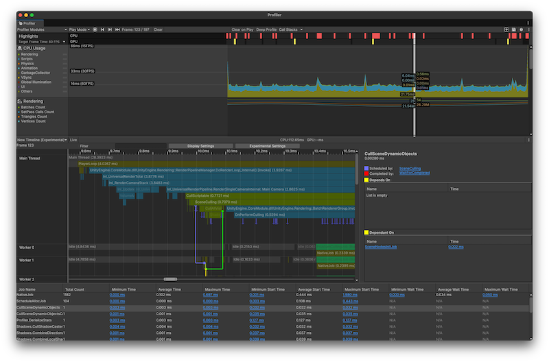

# Jobs Profiler introduction

Explore jobs data with the Jobs Profiler.

The Jobs Profiler adds an experimental Timeline view to the [CPU Usage Profiler module](xref:um-profiler-cpu). The new timeline view adds extra panels to the module details pane at the bottom half of the Profiler window. It gives an improved overview of where your application spends time [on jobs](xref:um-job-system) in a frame and highlights areas for improvement, such as wait on the main thread which is one of the biggest causes for slow performance.

  _Jobs Profiler with some data loaded_

The extra panels display information related to the jobs in your application, including a list of all jobs, and a list of their dependencies. This view also adds job lines to the Timeline view, which displays what scheduled or completed a job, and any dependencies the job might have.

## Workflows

You can use the Jobs Profiler to investigate when Unity scheduled jobs and on what core they are running on.

It's also useful to investigate when the main thread is idle and waiting for jobs to complete. For more information on the settings and statistics available, refer to [Jobs Profiler reference](ui-reference).

## Additional resources

* [Job system overview](xref:um-job-system-overview)
* [CPU Usage Profiler module](xref:um-profiler-cpu)
* [Using the Jobs Profiler](using-jobs-profiler.md)